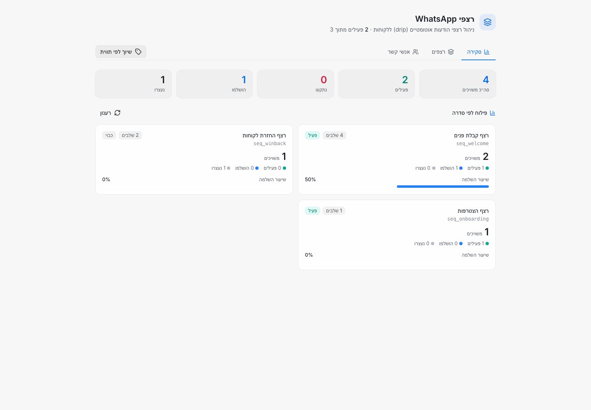
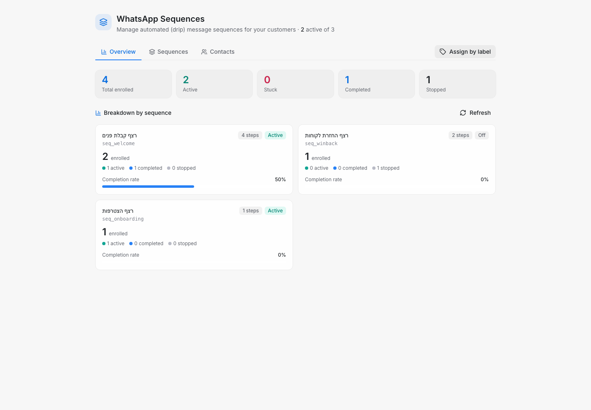
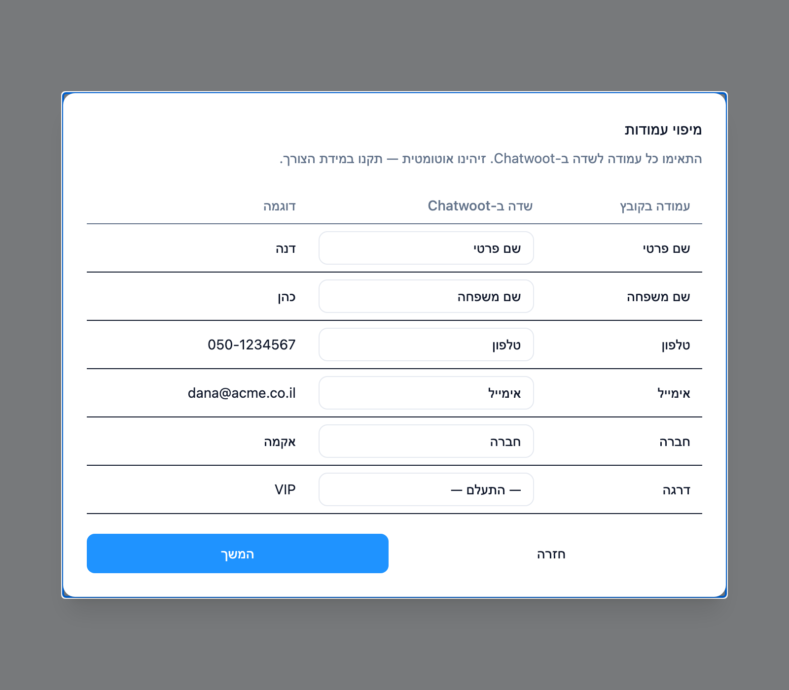
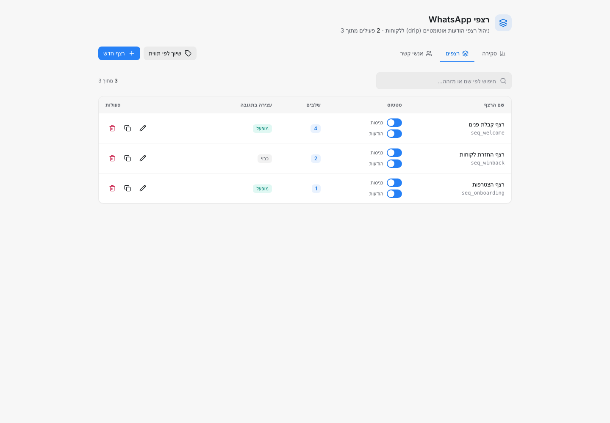
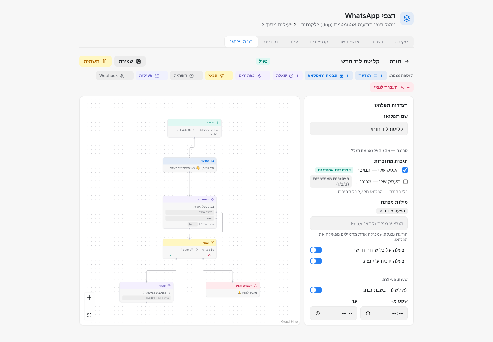
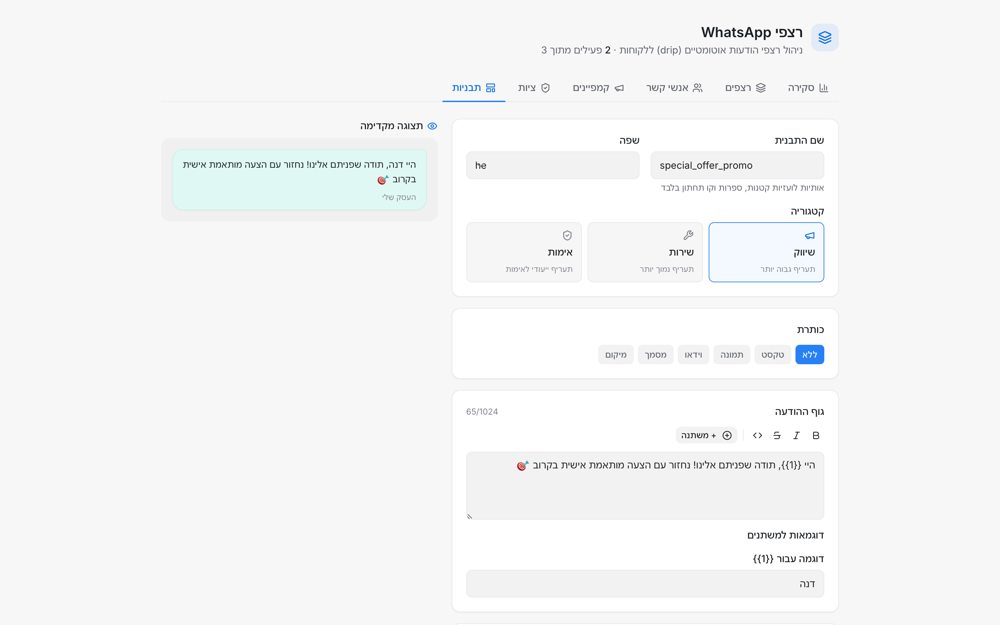
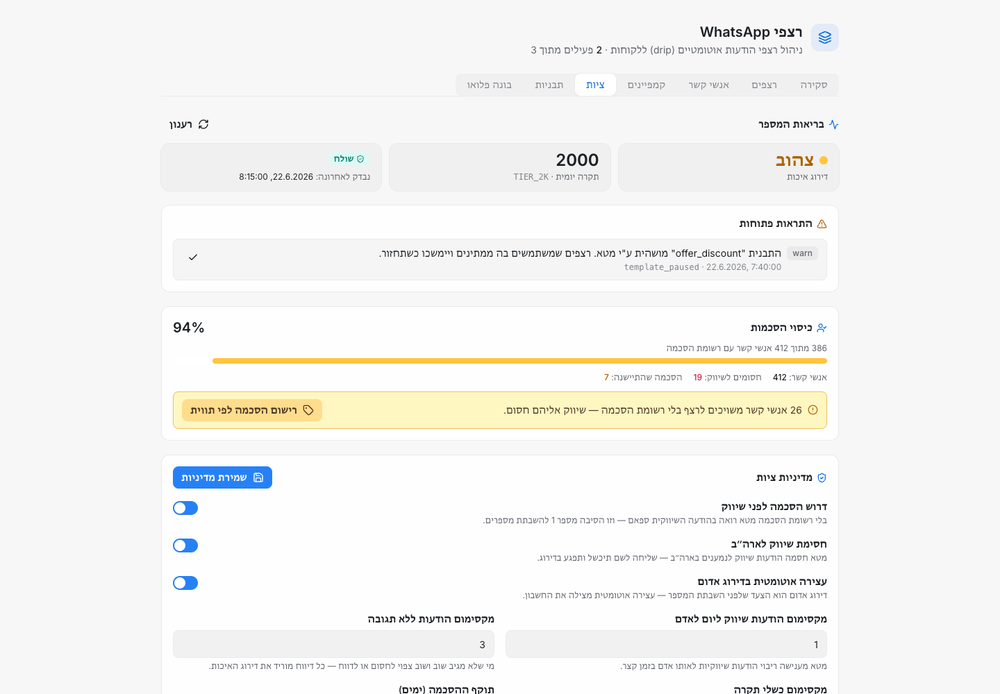
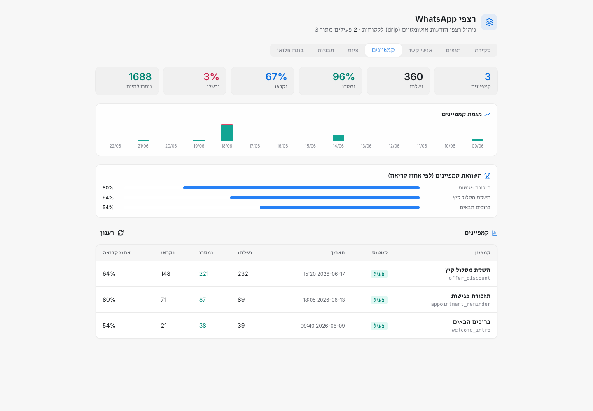
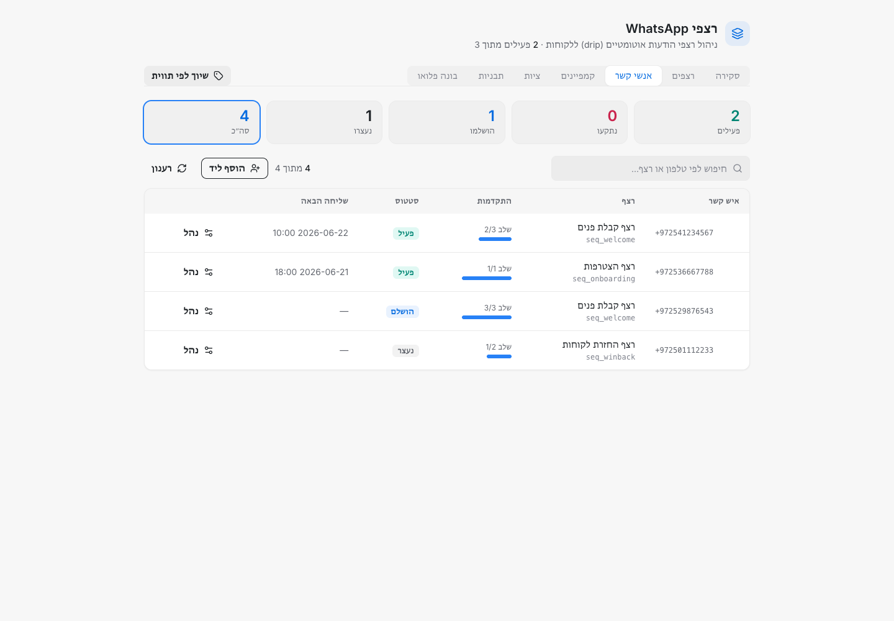
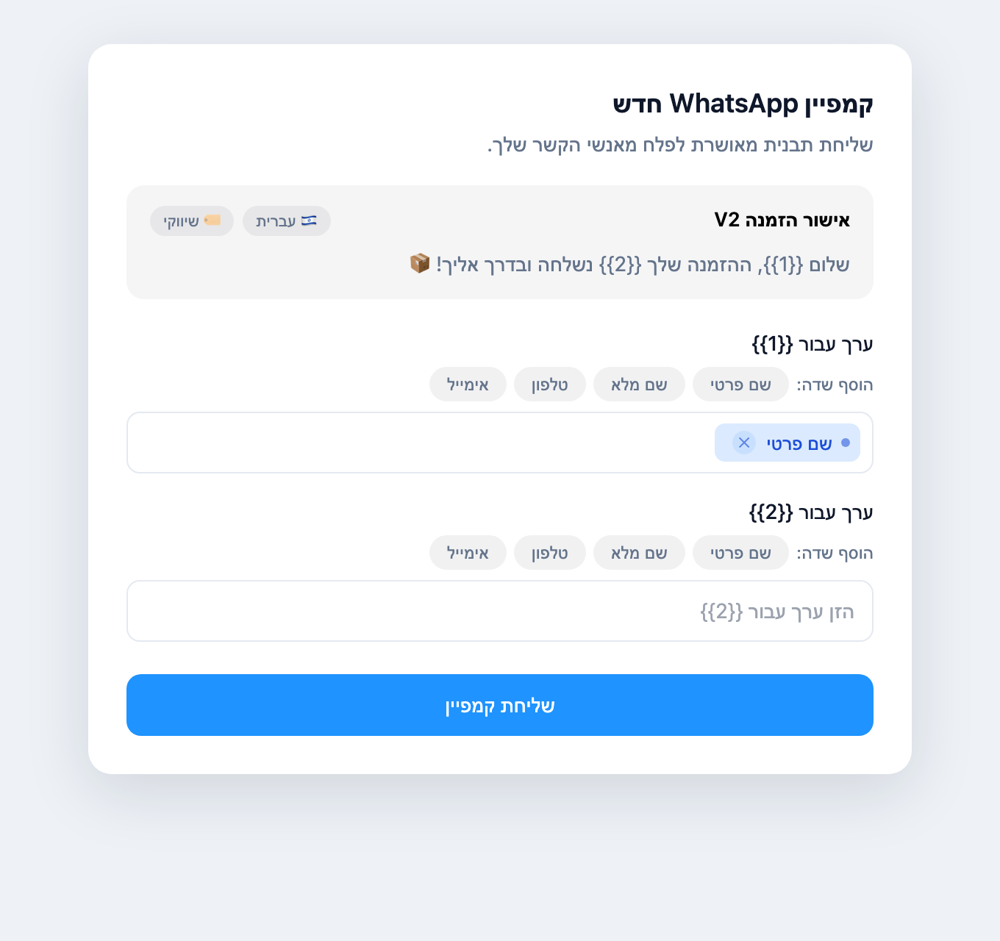

# chatwoot-power-tools

**פקודה אחת מוסיפה ל-Chatwoot העצמאי שלכם ייבוא אנשי-קשר חכם, רצפי WhatsApp אוטומטיים,
בונה פלואו ויזואלי, סטודיו תבניות, בלמי ציות ואנליטיקת קמפיינים — בלי שרת נפרד, בלי
סאב-דומיין, בלי הרשמה לשירות נוסף.**

[](LICENSE)
[](https://github.com/achiya-automation/chatwoot-power-tools/stargazers)
[](https://github.com/achiya-automation/chatwoot-power-tools/actions/workflows/ci.yml)

> תיעוד זה הוא תרגום מלא ומקביל ל-[README.md](README.md) האנגלי. קוד ותיעוד ציבורי אחר
> בפרויקט זה כתובים באנגלית.

chatwoot-power-tools מתקין container קטן (sidecar) בתוך ה-Docker Compose stack הקיים של
Chatwoot. כל מה שהוא מוסיף מוגש **מאותו origin**, תחת route יחיד `/chatwoot-addons/*` —
בלי דומיין נפרד, בלי CORS, בלי התחברות נוספת.

> **לא מיועד ל-Chatwoot Cloud.** ההתקנה מוסיפה container, role במסד הנתונים, ו-route
> ב-reverse proxy — ישירות על השרת שלכם. פעולות שאינן אפשריות בשירות המנוהל Chatwoot
> Cloud. מיועד ל-Chatwoot עצמאי (self-hosted) על Docker Compose בלבד. ראו
> [docs/hosting.md](docs/hosting.md) אם אתם שוקלים בין השניים.

## 🌍 דו-לשוני — עברית ואנגלית, אוטומטית

כל הדשבורד מותאם לשפה שכל נציג בחר ב-Chatwoot — **אנגלית (LTR)** או **עברית (RTL)** —
זיהוי אוטומטי, ללא הגדרה. אותו מסך, בשתי הצורות:

<table>
<tr><td width="50%" align="center"><b>🇮🇱 עברית</b></td><td width="50%" align="center"><b>🇬🇧 English</b></td></tr>
<tr><td></td><td></td></tr>
</table>

## תכונות

### 📥 ייבוא אנשי-קשר חכם
אשף ייבוא CSV/Excel, בעיצוב זהה ל-Chatwoot עצמו. מזהה עמודות בשתי שפות (עברית ואנגלית),
מסמן כפילויות לפני הייבוא, ממפה עמודות למאפיינים מותאמים-אישית (custom attributes) של
Chatwoot, ומתייג — הכול מתוך הדשבורד.



### 🔁 רצפי WhatsApp אוטומטיים
רצפי הודעות-תבנית אוטומטיים ב-WhatsApp Cloud API, מנוהלים במלואם מתוך Chatwoot. שיוך ליד
לרצף נעשה על-ידי הגדרת מאפיין על השיחה; ההודעות נשלחות במרווחים שהגדרתם לכל שלב, עם דילוג
אוטומטי על שעות-שקט, שבת, וחגים יהודיים.



### 🔀 בונה פלואו ויזואלי
בונה גרירה-ושחרור לשיחות מסתעפות. עשרה סוגי צמתים — **טריגר, הודעה, תבנית וואטסאפ, שאלה,
כפתורים, תנאי, השהיה, פעולות, webhook והעברה לנציג** — מחוברים על קנבס. תנאים נושאים
הסתעפות `כן`/`לא`, ושאלות מוודאות את התשובה (טקסט, מספר, אימייל, טלפון) לפני שהיא נשמרת
למשתנה.

פלואו מתחיל ממילת מפתח, מכל שיחה חדשה, או בהפעלה ידנית של נציג. התשובות נשמרות לכל ריצה
וניתן להתייחס אליהן בהמשך הפלואו — כך ששאלה בתחילת הדרך יכולה להזין תנאי בהמשכה. שעות שקט
ועצירה בשבת ובחג חלים כאן בדיוק כמו ברצפים, וכל ריצה ניתנת לבדיקה או לעצירה מפאנל הריצות.



### 🗂️ סטודיו התבניות
יצירה, הגשה וניהול של תבניות WhatsApp בלי לצאת מ-Chatwoot — מעקב אחר סטטוס האישור של מטא
ודירוג האיכות לכל תבנית, ועריכה בבונה מלא עם תצוגה מקדימה בסגנון WhatsApp, כרטיסי קרוסלה,
תבניות אימות (OTP), הצעות מוגבלות-זמן, וכל סוגי הכפתורים — טלפון, URL, קודי קופון וטפסי
WhatsApp Flow. תבניות מאושרות מסתנכרנות מיידית לבורר התבניות המובנה של Chatwoot, והמסך
מוגבל למנהלי החשבון.



### 🛡️ ציות
המסך ששומר על מספר ה-WhatsApp שלכם בחיים. הוא מציג את דירוג האיכות ומדרגת השליחה החיים
ישירות ממטא, את סטטוס האישור והאיכות של כל תבנית, וכל התראה פתוחה.

ההסכמה נרשמת לכל איש קשר (או בכמות גדולה לפי תווית ב-Chatwoot) ו**נדרשת לפני שיווק**
כברירת מחדל, עם מד כיסוי שנמדד מול אנשי הקשר שנמצאים בפועל ברצף. בקשות הסרה מזוהות במילים
של הלקוח עצמו — עברית ואנגלית, בהתאמה ברמת מילה שלמה כך ש"הסרטון" לא ייקרא כ"הסר" — והתאמה
חוסמת את איש הקשר לצמיתות. התקרה האישית המסתגלת של מטא מטופלת אחרת: אנשי קשר כאלה נדחים
ולא מוסרים, כי התקרה הזו מתרופפת עם הזמן.

כשהאיכות יורדת לאדום, או כשהמסירה בפועל צונחת מתחת לרצפה שהגדרתם, השליחה נעצרת אוטומטית
וממתינה לכם. כל בלם ניתן לכוונון מהמסך הזה.



פירוט מלא של הכללים שזה מיישם ואיפה כל אחד מהם יושב בקוד:
[docs/meta-compliance.md](docs/meta-compliance.md) (אנגלית).

### 📊 אנליטיקת קמפיינים
Chatwoot אומר לכם שקמפיין נשלח. זה אומר לכם מה קרה לו.

כל קמפיין WhatsApp מקבל משפך מסירה — קהל ← נוסו ← נשלחו ← נמסרו ← נקראו — יחד עם מגמה
יומית והשוואת אחוזי קריאה בין קמפיינים. פתיחת קמפיין מציגה שורה לכל נמען עם התוצאה האמיתית
שלו, ולכישלונות — **את הסיבה שמטא החזירה**, לצד קישור ישיר לשיחה ב-Chatwoot. אנשי קשר שהיו
בקהל אך מעולם לא נוצתה עבורם שליחה מופיעים בנפרד, כך שנפילה שקטה נראית לעין במקום להיעלם.



### 👥 אנשי קשר
כל הלידים שנמצאים כרגע ברצף, בטבלה אחת: איזה רצף, איזה שלב, מה קורה הלאה ומתי. חיפוש לפי
טלפון או רצף, סינון לפי מצב (פעיל / תקוע / הושלם / נעצר), שיוך ליד ידנית, או שיוך המוני של
כל מי שנושא תווית ב-Chatwoot. כל שורה פותחת פאנל להתחלה מחדש, קידום, או הסרה של אותו ליד
מהרצף שלו.



### ✨ שדרוגי דשבורד
מוסיף פריט "רצפים" לסיידבר הראשי, משדרג את מודאל קמפיין ה-WhatsApp המובנה של Chatwoot עם
צ'יפים למשתנים ותצוגה מקדימה חיה של ההודעה, ומוסיף כפתור דחיסת-וידאו בצד הלקוח (דרך
WebCodecs) כדי לצרף וידאו מעבר למגבלת 16MB של WhatsApp בלי שלב טרנסקודינג בצד השרת.



## 🔒 אבטחה

נבנה כך שיהיה בטוח להרצה על דסק תמיכה בפרודקשן:

- **role במסד נתונים עם הרשאות מינימליות.** `drip_engine` מקבל `SELECT` על קומץ הטבלאות
  שהמנוע קורא בלבד, ובנוסף `UPDATE` על **עמודה אחת** (`contacts.custom_attributes`). הוא
  לא יכול לקרוא או לשנות שמות, טלפונים, אימיילים או כל דבר אחר — באג במנוע פשוט *לא יכול*
  לגעת בהם.
- **אין secrets בריפו הזה.** הסיסמה של ה-role נוצרת על **השרת שלכם** עם `openssl rand`
  ונכתבת רק ל-`.env` של Chatwoot. היא לא נכנסת ללוגים, לפלט פקודות, או ל-git.
- **אין טלמטריה, אין צד שלישי.** המנוע מתקשר רק עם ה-API של Chatwoot שלכם ועם ה-API
  הציבורי של [Hebcal](https://www.hebcal.com/) לתאריכי חגים. שום דבר אחר.
- **לא הרסני.** `--uninstall` מסיר כל מה שהוסיף ו**משמר תוכן קיים ב-`DASHBOARD_SCRIPTS`**
  (עורך רק את הבלוק המסומן שלו) ואת הנתונים שלכם.
- **בטוח לכוון על מספר WhatsApp חי.** הסכמה נדרשת לפני שיווק כברירת מחדל, בקשות הסרה
  מכובדות אוטומטית, והשליחה נעצרת מעצמה כשדירוג האיכות של מטא — או המסירה בפועל — צונח.

## התקנה מהירה

הריצו זאת **על שרת ה-Chatwoot העצמאי שלכם**, כ-root או עם sudo:

```bash
curl -fsSL https://github.com/achiya-automation/chatwoot-power-tools/archive/refs/heads/main.tar.gz | tar xz \
  && cd chatwoot-power-tools-main \
  && sudo bash install.sh
```

הפקודה מזהה את התקנת ה-Chatwoot שלכם, מבקשת אישור כן/לא, ומתקינה את כל שלושת המודולים
(הוסיפו `--modules=` כדי לבחור תת-קבוצה — ראו למטה). מעדיפים לבדוק את הקוד קודם (מומלץ),
או להשתמש ב-`git`?

```bash
git clone https://github.com/achiya-automation/chatwoot-power-tools.git
cd chatwoot-power-tools
sudo bash install.sh --dry-run   # הצגת התוכנית המלאה, ללא שינויים בפועל
sudo bash install.sh             # התקנה בפועל
```

## מודולים

| מודול | דגל `--modules=` | מה הוא מוסיף |
|---|---|---|
| ייבוא אנשי-קשר חכם | `import` | אשף ייבוא CSV/Excel בדשבורד |
| רצפי WhatsApp | `sequences` | מנוע ה-sidecar והדשבורד המלא שלו: רצפים, בונה פלואו, סטודיו תבניות, ציות, אנליטיקת קמפיינים, אנשי קשר — ובנוסף הפריט בסיידבר |
| שדרוגי דשבורד | `dashboard` | שדרוג מודאל הקמפיין + דחיסת וידאו |

מודול ה-`sequences` הוא יחידת התקנה אחת, לא שש — כל המסכים שלמעלה חיים באותה אפליקציית
sidecar וחולקים את המנוע ואת סכמת מסד הנתונים שלה.

התקינו את כל השלושה (ברירת מחדל), או רק את מה שאתם צריכים:

```bash
sudo bash install.sh --modules=all
sudo bash install.sh --modules=import,sequences
sudo bash install.sh --modules=dashboard
```

## שימוש

```
Usage: install.sh [options]

  --dry-run          Show the installation plan; make no changes.
  --uninstall        Remove chatwoot-power-tools (route, engine container, dashboard
                      script). The provisioned database role/schema is left in place —
                      a manual DROP is printed, never run automatically.
  --modules=LIST      Comma-separated: all | import,sequences,dashboard (default: all).
  --yes               Do not prompt for confirmation.
  -h, --help          Show this help.
```

הסרה היא אותה פקודה עם דגל אחד:

```bash
sudo bash install.sh --uninstall
```

## דרישות

- התקנת Chatwoot **עצמאית** (self-hosted) על Docker Compose v2, על שרת Linux שיש לכם
  אליו גישת root/sudo.
- Chatwoot v4.x (נבדק אמפירית מול v4.15.1 — ההתקנה מזהה שמות containers ושירותים באופן
  דינמי במקום להניח מבנה קבוע, ולכן צפויה לעבוד באותה צורה על גרסאות v4.x אחרות).
- reverse proxy מול Chatwoot: Caddy או nginx מקבלים route אוטומטי; כל אחר (Traefik וכו')
  מקבל קטע קונפיגורציה מוכן-להעתקה במקום זאת.

## איך זה עובד

`install.sh` מזהה את הסביבה שלכם, מקצה role+schema במסד הנתונים עם הרשאות מינימליות,
מפעיל container קטן (`cwpt-engine`) לצד ה-containers הקיימים של Chatwoot, מוסיף route
אחד ב-reverse proxy, ומזריק סקריפט דשבורד. פרטים טכניים מלאים — ההרשאות המדויקות של role
מסד הנתונים, אסטרטגיית מיזוג סקריפט הדשבורד, המנוע שמבצע self-migration — נמצאים ב-
[docs/ARCHITECTURE.md](docs/ARCHITECTURE.md) (אנגלית).

## שאלות נפוצות

**האם זה עובד עם Chatwoot Cloud?**
לא. ראו את ההערה למעלה ואת [docs/hosting.md](docs/hosting.md).

**האם מידע שלי נשלח לצד שלישי?**
לא. המנוע מתקשר רק עם ה-API של התקנת ה-Chatwoot שלכם עצמה — Chatwoot עצמו מעביר משם את
שליחות ה-WhatsApp הלאה ל-Meta, בדיוק כפי שהוא כבר עושה עבור כל ערוץ WhatsApp Cloud API —
ועם ה-API הציבורי של Hebcal לתאריכי חגים יהודיים. אין אנליטיקה, אין טלמטריה.

**מה בדיוק ההתקנה נוגעת בו על השרת שלי?**
role+schema אחד במסד הנתונים (`drip_engine`/`drip`, הרשאות מינימליות — ראו
[docs/ARCHITECTURE.md](docs/ARCHITECTURE.md)), container אחד (`cwpt-engine`), route אחד
ב-reverse proxy (`/chatwoot-addons/*`), ובלוק מסומן אחד בתוך ההגדרה `DASHBOARD_SCRIPTS`
של Chatwoot (כל תוכן קיים שם נשמר, לא נדרס).

**אפשר להסיר בצורה נקייה?**
כן — `sudo bash install.sh --uninstall` מבטל את כל מה שלמעלה. ה-role/schema במסד הנתונים
נשארים במכוון (פקודת `DROP` ידנית מודפסת למסך) — מחיקת נתונים אוטומטית היא לא החלטה
שההתקנה צריכה לקבל במקומכם.

**ה-reverse proxy שלי הוא לא Caddy או nginx. מה עכשיו?**
ההתקנה מדפיסה בלוק קונפיגורציה מוכן-להעתקה במקום להיכשל.

**זה חינם?**
התוכנה חינמית ומורשית ב-MIT. הפעלתה עדיין עולה כמה שהשרת שלכם כבר עולה. ראו
[docs/hosting.md](docs/hosting.md) למבט שקוף על אפשרויות אחסון, כולל שירות התקנה/תחזוקה
בתשלום אם אתם מעדיפים לא להריץ את ההתקנה בעצמכם.

## הרצה מקומית — לראות את הדשבורד בלי להתקין כלום

כל המסכים שלמעלה רצים מקומית מול נתוני דמו — בלי Chatwoot, בלי מסד נתונים, בלי חשבון
WhatsApp:

```bash
cd modules/sequences/webapp && npm install && npm run dev
```

ואז לפתוח **`http://localhost:5173/?mock=1&account_id=1`**. אפשר להוסיף `&tab=`
(`overview`, `sequences`, `contacts`, `campaigns`, `compliance`, `templates`, `journeys`)
כדי לנחות ישירות על מסך מסוים, ו-`&locale=he` או `&locale=en` להחלפת שפה — כך צולמו
הצילומים ב-README הזה.

נתוני הדמו יושבים ב-`src/data/devFixtures.js`, ובמכוון אינם חשבון מושלם: תבנית מושהית
אחת, דירוג איכות צהוב והתראה פתוחה — כדי שהמצבים שבאמת חשובים יהיו גלויים. כל הקובץ
נגזם מ-build של production (`import.meta.env.DEV`) ולעולם לא מגיע להתקנה אמיתית.

## תרומה לפרויקט (Contributing)

Issues ו-Pull Requests מתקבלים בברכה — ראו את תבניות ה-issue לדיווח באגים ובקשות
פיצ'רים. CI (‏`.github/workflows/ci.yml`) מריץ את חבילת הטסטים המלאה (‏`node --test`
בשלושת המודולים, וחבילת `bats` ל-`install.sh`/`lib/`) על כל push ו-pull request.

## רישיון

[MIT](LICENSE)

---

נבנה על-ידי [Achiya Automation](https://achiya-automation.com). מודל ההכנסה של הפרויקט
שקוף לחלוטין — ראו [docs/hosting.md](docs/hosting.md) לקישורי ה-referral הגלויים ולשירות
ההתקנה/תחזוקה בתשלום.
