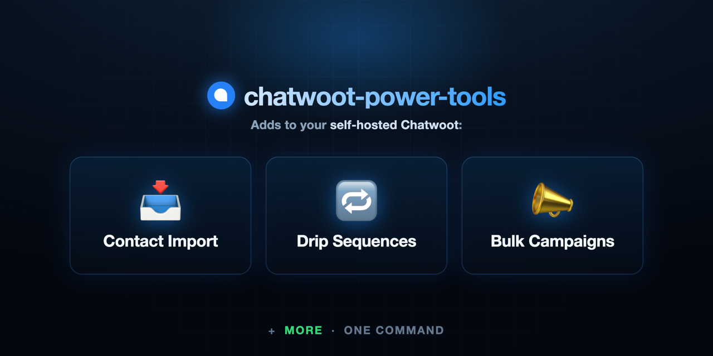
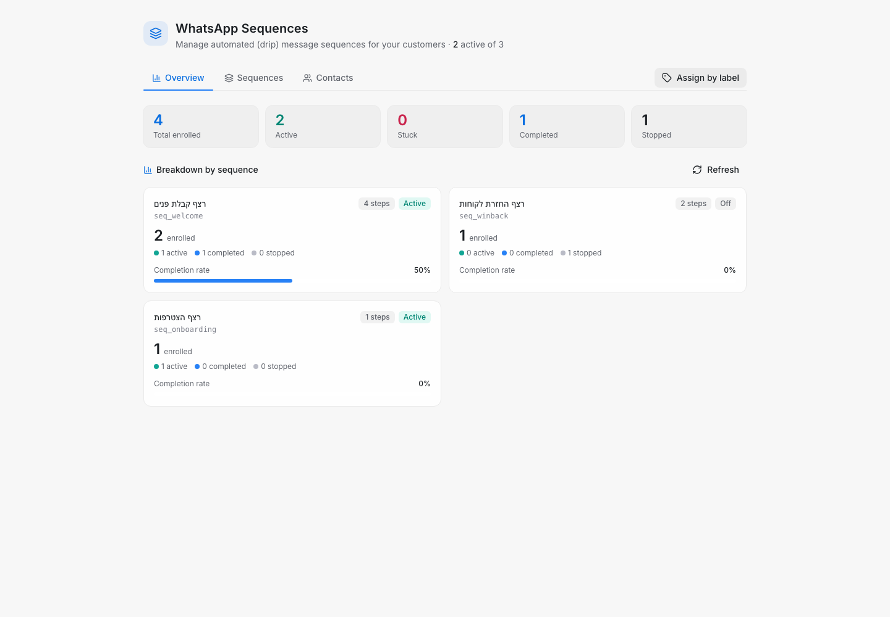
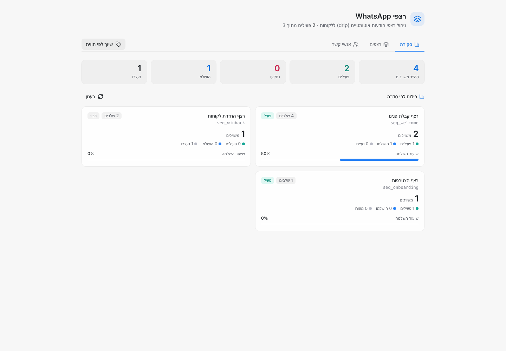
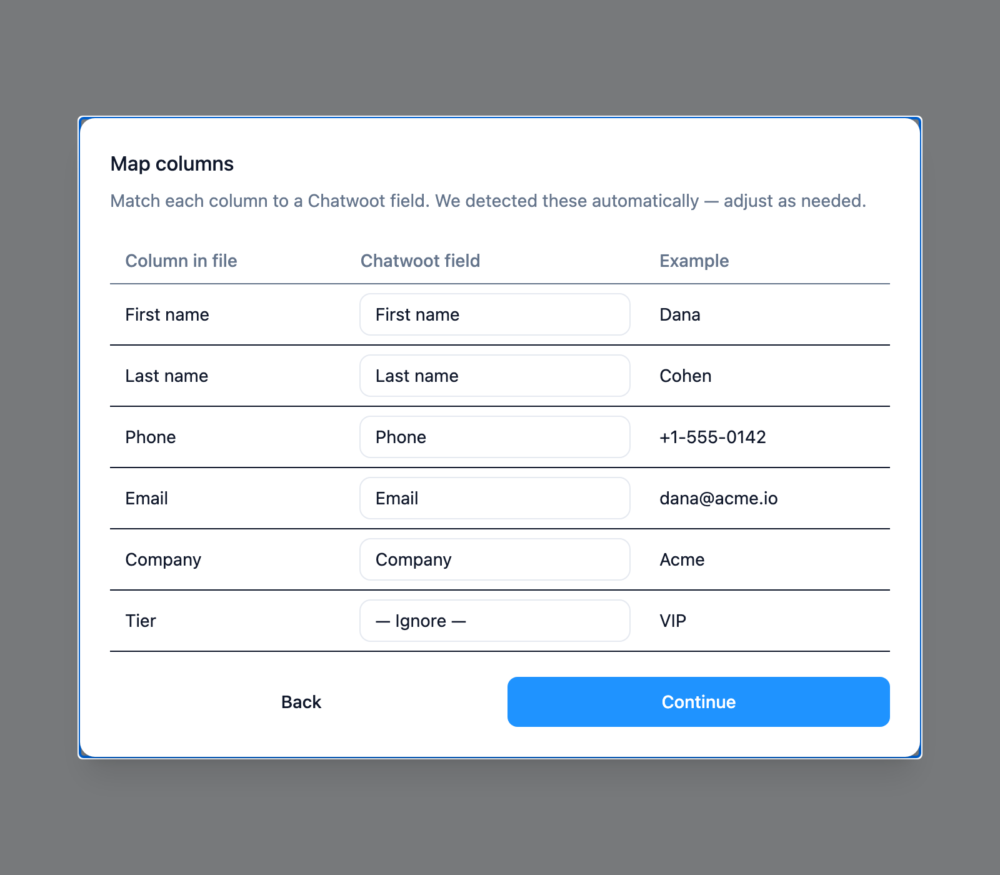
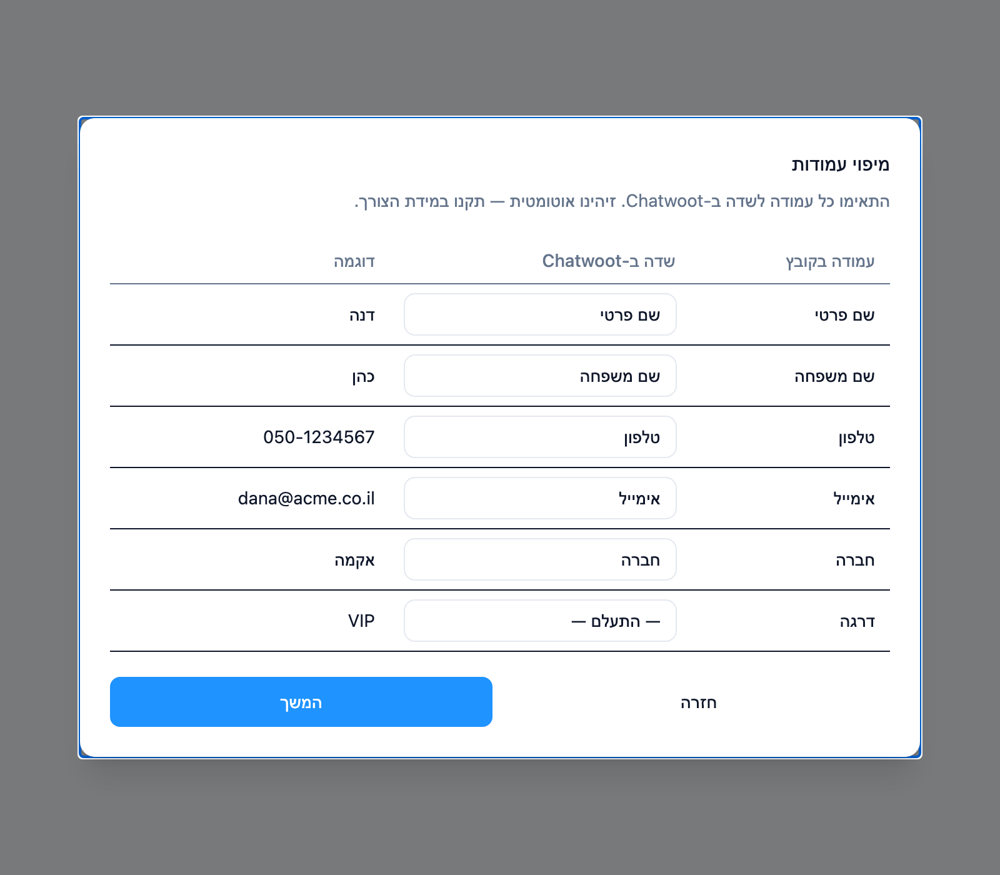
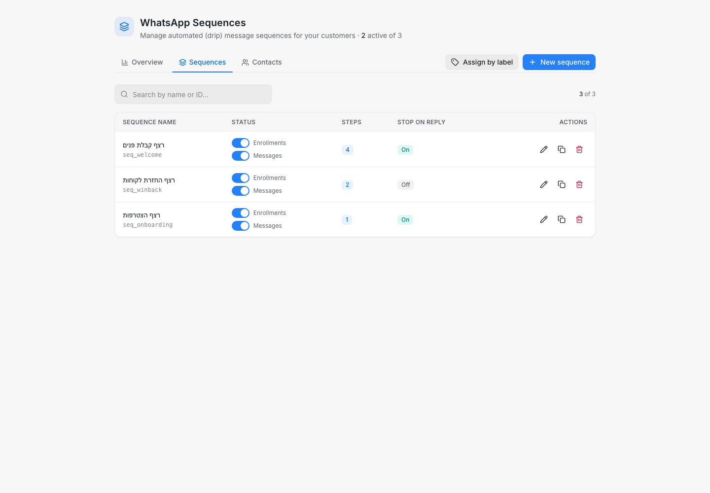
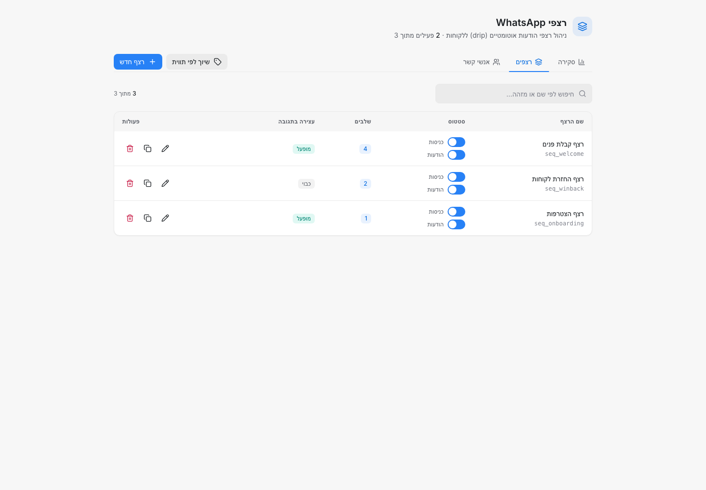
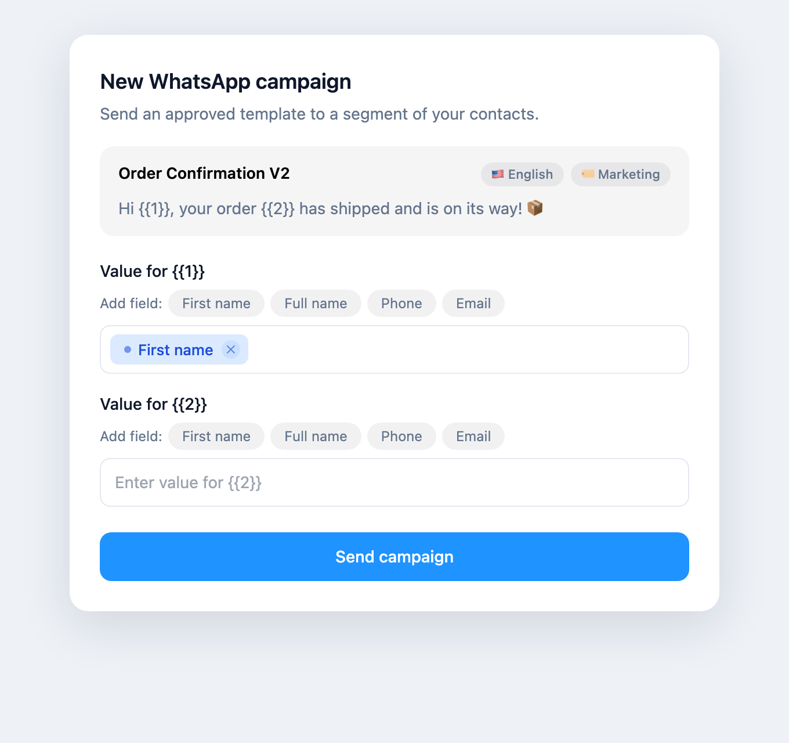

<div align="center">



# ⚡ chatwoot-power-tools

**The power-ups your self-hosted Chatwoot has been missing.**

*Smart contact import · WhatsApp drip sequences · dashboard upgrades — one command, same-origin, no SaaS, no second server.*

[](LICENSE)
[](https://github.com/achiya-automation/chatwoot-power-tools/actions/workflows/ci.yml)
[](https://github.com/achiya-automation/chatwoot-power-tools/stargazers)
[](https://www.chatwoot.com/)
[](https://docs.docker.com/compose/)

**3 modules** · **one `curl \| bash`** · **same-origin (zero CORS)** · **least-privilege DB role** · **no telemetry**

[Quick Start](#quick-start) · [Modules](#modules) · [Why](#-without-chatwoot-power-tools) · [Security](#-security) · [Architecture](docs/ARCHITECTURE.md) · [FAQ](#faq)

</div>

---

## ❌ Without chatwoot-power-tools

Self-hosted Chatwoot is excellent for support — but the moment you want to *grow*:

- **Importing contacts** means hand-writing API calls, or clicking them in one at a time
- **WhatsApp drip / follow-up sequences** aren't built in at all
- **Bulk campaigns** have no variable preview, and any video over WhatsApp's 16MB limit is a dead end

…and every off-the-shelf "fix" is a separate SaaS, a second server, or a subdomain with its own login and its own copy of your customer data.

## ✅ With chatwoot-power-tools

**One command** adds all three — *inside the Chatwoot you already run*. Everything is served **same-origin** under a single `/chatwoot-addons/*` route: no separate domain, no CORS, no extra login, and **no customer data ever leaves your server**.

```bash
curl -fsSL https://github.com/achiya-automation/chatwoot-power-tools/archive/refs/heads/main.tar.gz | tar xz \
  && cd chatwoot-power-tools-main && sudo bash install.sh
```

> **Not for Chatwoot Cloud.** This installs a container, a database role, and a reverse-proxy route directly on your server — none of which is possible on the managed Chatwoot Cloud offering. Self-hosted Docker Compose only. Weighing the two? See [docs/hosting.md](docs/hosting.md).

---

## Highlights

- **📥 Smart contact import** — a CSV/Excel wizard that looks native, detects columns bilingually (Hebrew + English), de-dupes before import, and maps onto custom attributes
- **🔁 WhatsApp drip sequences** — automated template-message sequences, managed from inside Chatwoot, with automatic skipping of quiet hours, Shabbat, and Jewish holidays
- **✨ Dashboard upgrades** — a "Sequences" sidebar item, a supercharged campaign modal (variable chips + live preview), and client-side video compression past the 16MB WhatsApp limit
- **🧩 Modular** — install all three, or exactly the ones you want (`--modules=`)
- **🔒 Least-privilege by design** — a DB role that can `SELECT` a few tables and write **one column**, nothing more (see [Security](#-security))
- **♻️ Clean uninstall** — one flag reverses everything and preserves your data + any existing dashboard scripts

---

## 🌍 Bilingual — Hebrew & English, automatic

The entire dashboard localizes to each agent's own Chatwoot language — **English (LTR)** or **Hebrew (RTL)** — detected automatically, with zero configuration. The same screen, either way:

<table>
<tr><td width="50%" align="center"><b>🇬🇧 English</b></td><td width="50%" align="center"><b>🇮🇱 עברית</b></td></tr>
<tr><td></td><td></td></tr>
</table>

---

## Features

### 📥 Smart Contact Import
A CSV/Excel import wizard, styled to match Chatwoot's own UI. Detects columns bilingually (Hebrew and English headers), flags duplicates before import, maps columns onto Chatwoot custom attributes, and applies tags — all from inside the dashboard.

<table>
<tr><td width="50%" align="center"><b>🇬🇧 English</b></td><td width="50%" align="center"><b>🇮🇱 עברית</b></td></tr>
<tr><td></td><td></td></tr>
</table>

### 🔁 WhatsApp Drip Sequences
Automated WhatsApp Cloud API template-message sequences, managed entirely from inside Chatwoot. A lead is enrolled by setting a conversation attribute; messages then send at the intervals you configure per step, with automatic skipping of quiet hours, Shabbat, and Jewish holidays.

<table>
<tr><td width="50%" align="center"><b>🇬🇧 English</b></td><td width="50%" align="center"><b>🇮🇱 עברית</b></td></tr>
<tr><td></td><td></td></tr>
</table>

### ✨ Dashboard Enhancements
Adds a "Sequences" item to the main sidebar, upgrades Chatwoot's native WhatsApp campaign modal with variable chips and a live message preview, and adds a client-side video-compression button (via WebCodecs) so you can attach videos over WhatsApp's 16MB media limit without a server-side transcoding step.

<table>
<tr><td width="50%" align="center"><b>🇬🇧 English</b></td><td width="50%" align="center"><b>🇮🇱 עברית</b></td></tr>
<tr><td></td><td></td></tr>
</table>

---

## Quick Start

Run this **on your self-hosted Chatwoot host**, as root or with sudo:

```bash
curl -fsSL https://github.com/achiya-automation/chatwoot-power-tools/archive/refs/heads/main.tar.gz | tar xz \
  && cd chatwoot-power-tools-main \
  && sudo bash install.sh
```

It detects your Chatwoot installation, asks for a yes/no confirmation, and installs all three modules. Prefer to review the code first (recommended) or use `git`?

```bash
git clone https://github.com/achiya-automation/chatwoot-power-tools.git
cd chatwoot-power-tools
sudo bash install.sh --dry-run   # see the full plan — zero changes made
sudo bash install.sh             # install for real
```

## Modules

| Module | `--modules=` flag | What it adds |
|---|---|---|
| Smart Contact Import | `import` | CSV/Excel import wizard in the dashboard |
| WhatsApp Drip Sequences | `sequences` | Sequence engine + management UI + sidebar entry |
| Dashboard Enhancements | `dashboard` | Campaign modal upgrade + video compressor |

Install all three (default), or just the ones you want:

```bash
sudo bash install.sh --modules=all
sudo bash install.sh --modules=import,sequences
sudo bash install.sh --modules=dashboard
```

## Usage

```
Usage: install.sh [options]

  --dry-run          Show the installation plan; make no changes.
  --uninstall        Remove chatwoot-power-tools (route, engine container, dashboard
                      script). The provisioned database role/schema is left in place —
                      a manual DROP is printed, never run automatically.
  --modules=LIST     Comma-separated: all | import,sequences,dashboard (default: all).
  --yes              Do not prompt for confirmation.
  -h, --help         Show this help.
```

Uninstalling is the same command with one flag:

```bash
sudo bash install.sh --uninstall
```

---

## 🔒 Security

Built to be safe to run on a production support desk:

- **Least-privilege database role.** `drip_engine` gets `SELECT` on only the handful of Chatwoot tables the engine reads, plus `UPDATE` on a **single column** (`contacts.custom_attributes`). It cannot read or change names, phones, emails, or anything else — a bug in the engine simply *can't* touch them.
- **No secrets in this repo.** The role's password is generated on **your** server with `openssl rand` and written only to your Chatwoot `.env`. It never enters logs, command output, or git.
- **No telemetry, no third parties.** The engine talks only to your own Chatwoot API (which relays WhatsApp to Meta exactly as it already does for any WhatsApp channel) and the public [Hebcal](https://www.hebcal.com/) holiday API. Nothing else — no analytics, no phone-home.
- **Non-destructive.** `--uninstall` removes everything it added and **preserves any existing `DASHBOARD_SCRIPTS`** content (it edits only its own marked block) and your data. The DB role/schema is left for you to drop manually.
- **Auditable & previewable.** A plain, readable Bash installer — no opaque binaries piped to root. Every run is `--dry-run`-previewable, and the full test suite (`node --test` across all modules + a `bats` suite for `install.sh`/`lib/`) runs in CI on every push.

---

## Requirements

- A **self-hosted** Chatwoot instance on Docker Compose v2, on a Linux host you can access as root/sudo.
- Chatwoot v4.x (verified against v4.15.1 — the installer detects container and service names dynamically rather than assuming a fixed layout, so other v4.x releases are expected to work the same way).
- A reverse proxy in front of Chatwoot: **Caddy or nginx** get an automatic route; anything else (Traefik, etc.) gets a copy-paste config snippet printed instead.

## How it works

`install.sh` detects your environment, provisions a least-privilege database role + schema, starts a small sidecar container (`cwpt-engine`) alongside Chatwoot's own containers, adds one reverse-proxy route, and injects a dashboard script. Full technical details — the database role's exact grants, the dashboard-script merge strategy, the self-migrating engine — are in [docs/ARCHITECTURE.md](docs/ARCHITECTURE.md).

## FAQ

**Does this work with Chatwoot Cloud?**
No. See the callout above and [docs/hosting.md](docs/hosting.md).

**Is any of my data sent to a third party?**
No. The engine talks only to your own Chatwoot instance's API — Chatwoot itself then relays WhatsApp sends to Meta, exactly as it already does for any WhatsApp Cloud API channel — and to the public Hebcal API for Jewish holiday dates. No analytics, no telemetry.

**What exactly does the installer touch on my server?**
One database role + schema (`drip_engine` / `drip`, least-privilege — see [docs/ARCHITECTURE.md](docs/ARCHITECTURE.md)), one Docker container (`cwpt-engine`), one reverse-proxy route (`/chatwoot-addons/*`), and one marked block inside Chatwoot's `DASHBOARD_SCRIPTS` setting (any existing content there is preserved, not overwritten).

**Can I remove it cleanly?**
Yes — `sudo bash install.sh --uninstall` reverses all of the above. The database role/schema is deliberately left in place (a manual `DROP` command is printed) since destroying data automatically is not a call the installer should make for you.

**My reverse proxy isn't Caddy or nginx. Now what?**
The installer prints a ready-to-paste config block for your proxy instead of failing.

**Is this free?**
The software is free and MIT-licensed. Running it still costs whatever your server already costs. See [docs/hosting.md](docs/hosting.md) for a transparent look at hosting options, including a paid installation/maintenance service if you'd rather not run the installer yourself.

## Contributing

Issues and pull requests are welcome — see the issue templates for bug reports and feature requests. CI (`.github/workflows/ci.yml`) runs the full test suite (`node --test` across all three modules, plus the `bats` suite for `install.sh`/`lib/`) on every push and pull request.

## License

[MIT](LICENSE)

---

Built by [Achiya Automation](https://achiya-automation.com). This project's revenue model is fully transparent — see [docs/hosting.md](docs/hosting.md) for the disclosed referral links and the paid installation/maintenance service.
