<div align="center">

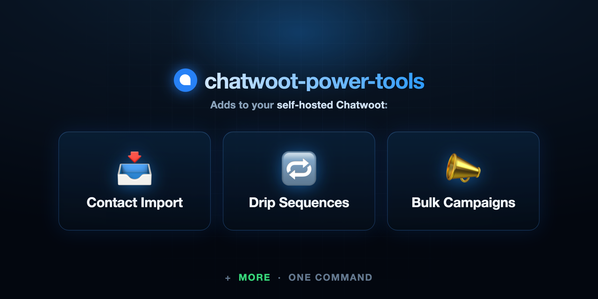

# ⚡ chatwoot-power-tools

**The power-ups your self-hosted Chatwoot has been missing.**

*Smart contact import · drip sequences · visual flow builder · template studio · compliance guardrails · campaign analytics — one command, same-origin, no SaaS, no second server.*

[](LICENSE)
[](https://github.com/achiya-automation/chatwoot-power-tools/actions/workflows/ci.yml)
[](https://github.com/achiya-automation/chatwoot-power-tools/stargazers)
[](https://www.chatwoot.com/)
[](https://docs.docker.com/compose/)

**3 modules** · **one `curl \| bash`** · **same-origin (zero CORS)** · **least-privilege DB role** · **no telemetry**

[Quick Start](#quick-start) · [Features](#features) · [Modules](#modules) · [Why](#-without-chatwoot-power-tools) · [Security](#-security) · [Compliance](docs/meta-compliance.md) · [Architecture](docs/ARCHITECTURE.md) · [FAQ](#faq)

</div>

---

## ❌ Without chatwoot-power-tools

Self-hosted Chatwoot is excellent for support — but the moment you want to *grow*:

- **Importing contacts** means hand-writing API calls, or clicking them in one at a time
- **WhatsApp drip / follow-up sequences** aren't built in at all
- **Branching conversations** — ask, wait for an answer, branch on it — have no builder
- **WhatsApp templates** must be created in Meta's Business Manager, in another tab
- **Bulk campaigns** have no variable preview, no delivery funnel afterwards, and any video over WhatsApp's 16MB limit is a dead end
- **Nothing watches your number's health** — quality drops, templates get paused, and you find out when sending stops working

…and every off-the-shelf "fix" is a separate SaaS, a second server, or a subdomain with its own login and its own copy of your customer data.

## ✅ With chatwoot-power-tools

**One command** adds all of it — *inside the Chatwoot you already run*. Everything is served **same-origin** under a single `/chatwoot-addons/*` route: no separate domain, no CORS, no extra login, and **no customer data ever leaves your server**.

```bash
curl -fsSL https://github.com/achiya-automation/chatwoot-power-tools/archive/refs/heads/main.tar.gz | tar xz \
  && cd chatwoot-power-tools-main && sudo bash install.sh
```

> **Not for Chatwoot Cloud.** This installs a container, a database role, and a reverse-proxy route directly on your server — none of which is possible on the managed Chatwoot Cloud offering. Self-hosted Docker Compose only. Weighing the two? See [docs/hosting.md](docs/hosting.md).

---

## Highlights

- **📥 Smart contact import** — a CSV/Excel wizard that looks native, detects columns bilingually (Hebrew + English), de-dupes before import, and maps onto custom attributes
- **🔁 WhatsApp drip sequences** — automated template-message sequences, managed from inside Chatwoot, with automatic skipping of quiet hours, Shabbat, and Jewish holidays
- **🔀 Visual flow builder** — a drag-and-drop conversation builder: trigger, message, template, question, buttons, condition, delay, action, webhook and handoff nodes
- **🛡️ WhatsApp compliance guardrails** — consent records, opt-out detection in the customer's own words, live quality monitoring, and an automatic halt before Meta disables your number
- **📊 Campaign analytics** — a delivery funnel, per-recipient outcomes with the reason each failure happened, and a read-rate comparison across campaigns
- **✨ Dashboard upgrades** — a "Sequences" sidebar item, a supercharged campaign modal (variable chips + live preview), native Hebrew fixes, and campaign delivery analytics
- **🧩 Modular** — install all three, or exactly the ones you want (`--modules=`)
- **🔒 Least-privilege by design** — read-only access to required Chatwoot data plus three narrowly scoped assignment/cache columns (see [Security](#-security))
- **♻️ Clean uninstall** — one flag reverses everything and preserves your data + any existing dashboard scripts

---

## 🌍 Bilingual — Hebrew & English, automatic

The entire dashboard localizes to each agent's own Chatwoot language — **English (LTR)** or **Hebrew (RTL)** — detected automatically, with zero configuration. The same screen, either way:

<table>
<tr><td width="50%" align="center"><b>🇬🇧 English</b></td><td width="50%" align="center"><b>🇮🇱 עברית</b></td></tr>
<tr><td></td><td></td></tr>
</table>

---

## Features

### 📥 Smart Contact Import
A CSV/Excel import wizard, styled to match Chatwoot's own UI. Detects columns bilingually (Hebrew and English headers), flags duplicates before import, maps columns onto Chatwoot custom attributes, and applies tags — all from inside the dashboard.

<table>
<tr><td width="50%" align="center"><b>🇬🇧 English</b></td><td width="50%" align="center"><b>🇮🇱 עברית</b></td></tr>
<tr><td>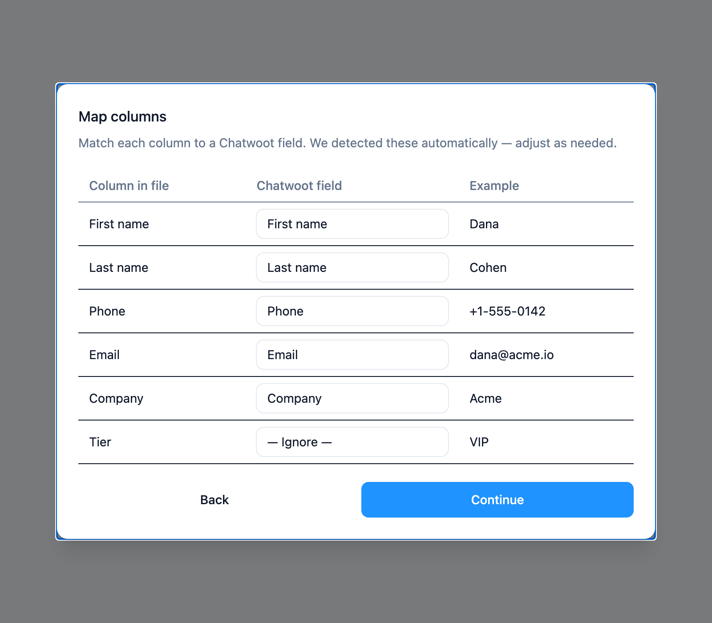</td><td></td></tr>
</table>

### 🔁 WhatsApp Drip Sequences
Automated WhatsApp Cloud API template-message sequences, managed entirely from inside Chatwoot. A lead is enrolled by setting a conversation attribute; messages then send at the intervals you configure per step, with automatic skipping of quiet hours, Shabbat, and Jewish holidays.

<table>
<tr><td width="50%" align="center"><b>🇬🇧 English</b></td><td width="50%" align="center"><b>🇮🇱 עברית</b></td></tr>
<tr><td>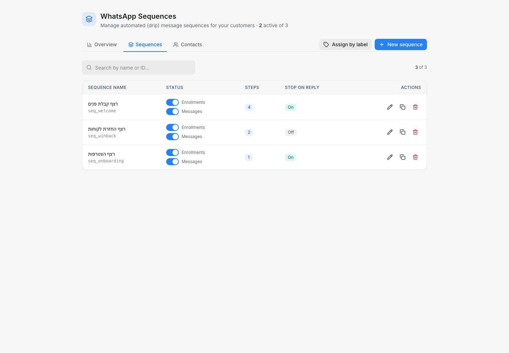</td><td></td></tr>
</table>

### ✨ Dashboard Enhancements
Adds a "Sequences" item to the main sidebar, upgrades Chatwoot's native WhatsApp campaign modal with variable chips and a live message preview, fills reusable template media automatically, fixes missing native Hebrew strings, and adds campaign delivery analytics.

<table>
<tr><td width="50%" align="center"><b>🇬🇧 English</b></td><td width="50%" align="center"><b>🇮🇱 עברית</b></td></tr>
<tr><td>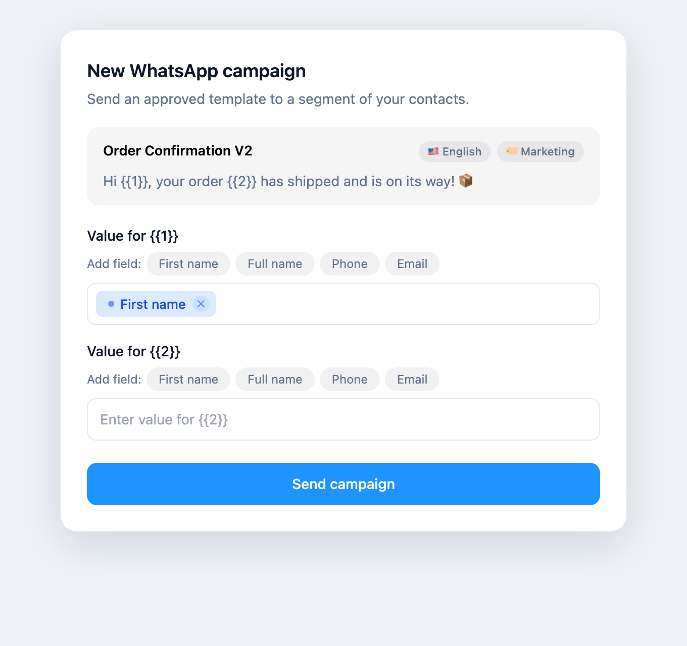</td><td></td></tr>
</table>

### 🗂️ Template Studio
Create, submit, and manage WhatsApp message templates without leaving Chatwoot — track each template's Meta approval status and quality rating, and edit with a full builder that has a live WhatsApp-style preview, carousel cards, authentication (OTP) templates, Limited-Time Offers, and every button type including phone, URL, coupon codes and WhatsApp Flow forms. Approved templates sync instantly into Chatwoot's native template picker, and the screen is restricted to account admins.

<table>
<tr><td width="50%" align="center"><b>🇬🇧 English</b></td><td width="50%" align="center"><b>🇮🇱 עברית</b></td></tr>
<tr><td>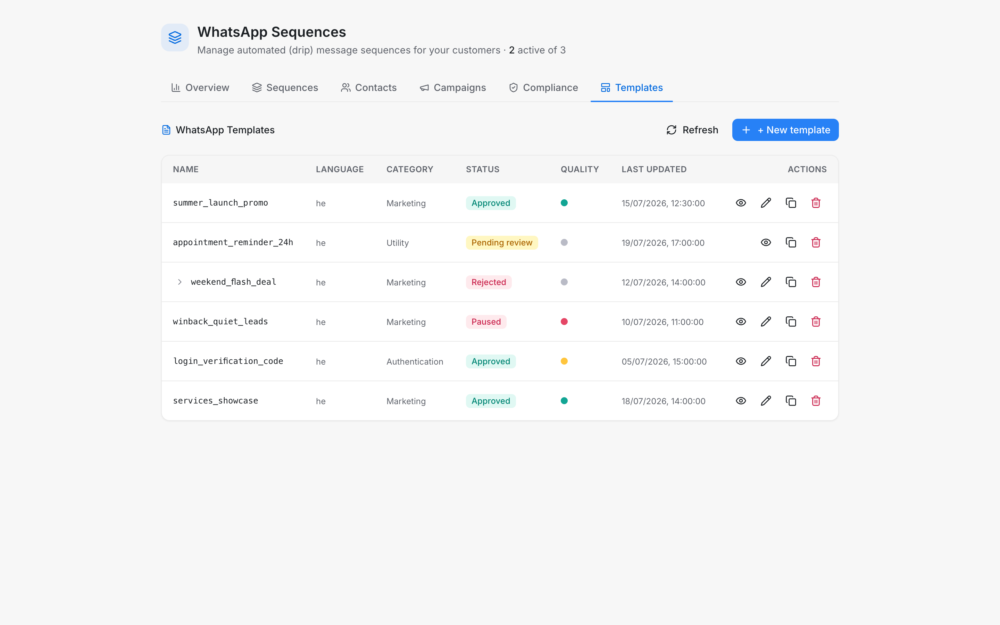</td><td>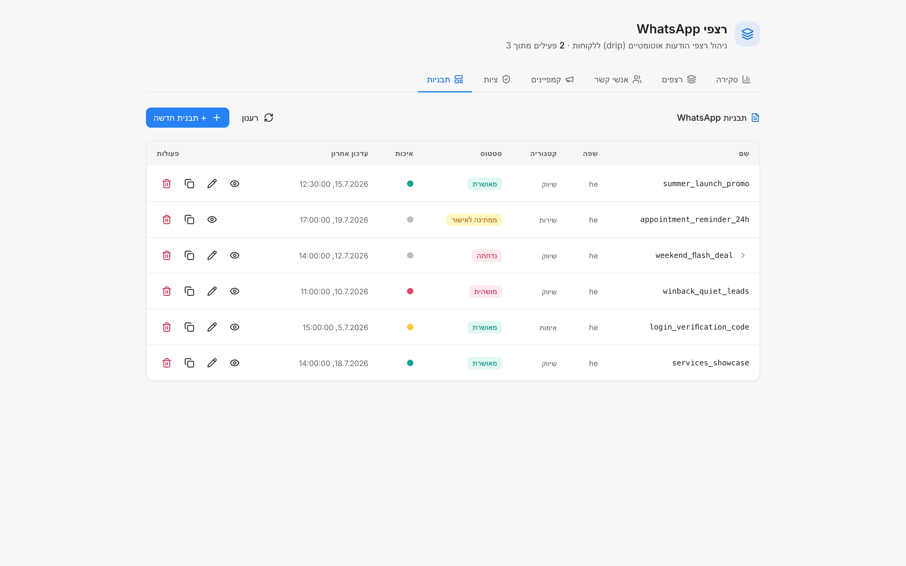</td></tr>
</table>

The builder itself, with the live WhatsApp-style preview updating as you type:

<table>
<tr><td width="50%" align="center"><b>🇬🇧 English</b></td><td width="50%" align="center"><b>🇮🇱 עברית</b></td></tr>
<tr><td>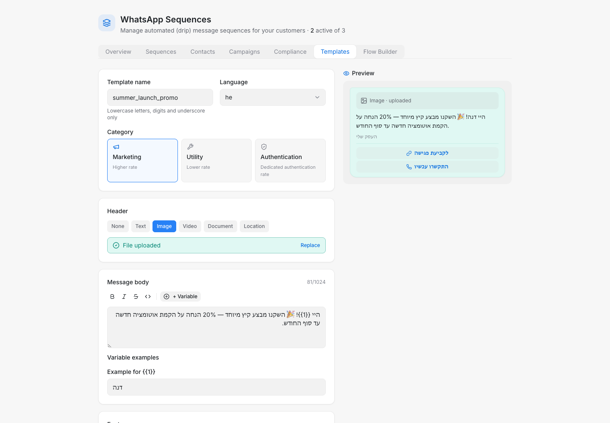</td><td></td></tr>
</table>

### 🔀 Visual Flow Builder
A drag-and-drop builder for conversations that branch. Ten node types — **trigger, message, WhatsApp template, question, buttons, condition, delay, action, webhook, handoff** — wired on a canvas, with conditions carrying `yes`/`no` branches and questions validating the answer (text, number, email, phone) before saving it to a variable.

A flow starts on a keyword, on every new conversation, or when an agent launches it manually. Answers are stored per run and are addressable later in the flow, so a question early on can drive a condition further down. Quiet hours and Shabbat/holiday pauses apply here exactly as they do to sequences, and any run can be inspected or stopped from the runs panel.

<table>
<tr><td width="50%" align="center"><b>🇬🇧 English</b></td><td width="50%" align="center"><b>🇮🇱 עברית</b></td></tr>
<tr><td>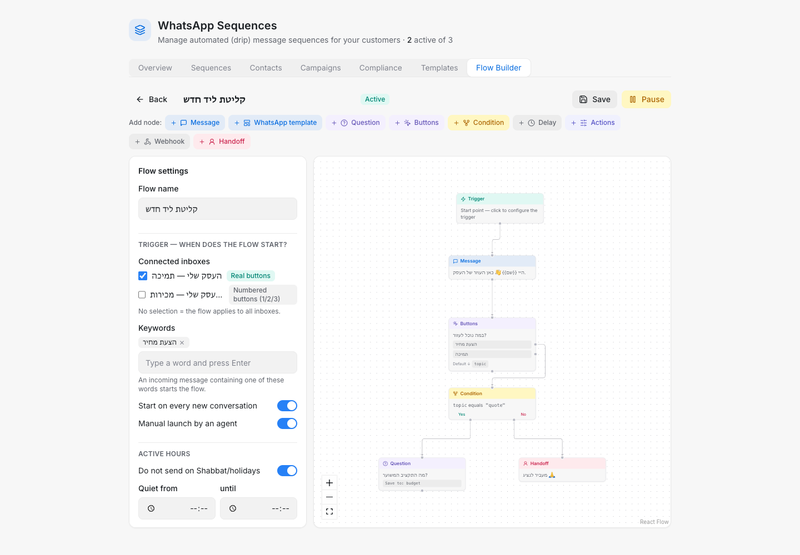</td><td></td></tr>
</table>

### 🛡️ Compliance
The screen that keeps your WhatsApp number alive. It shows the number's live quality rating and messaging tier straight from Meta, every template's approval status and quality, and any open alert.

Consent is recorded per contact (or in bulk from a Chatwoot label) and **required before marketing** by default, with a coverage bar measured against the contacts actually enrolled in a sequence. Opt-out requests are detected in the customer's own words — Hebrew and English, matched at whole-word level so "הסרטון" is not read as "הסר" — and a match suppresses the contact permanently. Meta's adaptive per-user cap is treated differently: those contacts are deferred, not removed, because that cap relaxes over time.

When quality goes red, or when actual delivery drops below a floor you set, sending halts automatically and waits for you. Every guard is tunable from this screen.

<table>
<tr><td width="50%" align="center"><b>🇬🇧 English</b></td><td width="50%" align="center"><b>🇮🇱 עברית</b></td></tr>
<tr><td>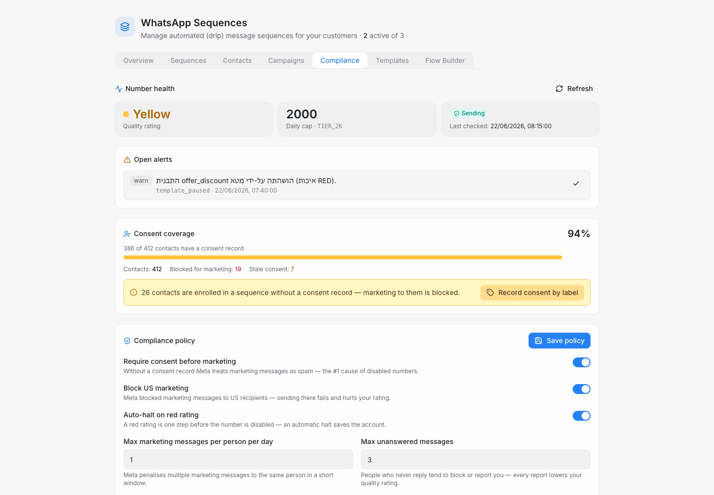</td><td></td></tr>
</table>

Full detail on the rules this implements and where each one lives in the code: [docs/meta-compliance.md](docs/meta-compliance.md).

### 📊 Campaign Analytics
Chatwoot tells you a campaign was sent. This tells you what happened to it.

Every WhatsApp campaign gets a delivery funnel — audience → attempted → sent → delivered → read — plus a daily trend and a read-rate comparison across campaigns. Open one and you get a row per recipient with its real outcome and, for failures, **the reason Meta gave**, alongside a link straight into that conversation in Chatwoot. Contacts that were in the audience but never got a send attempt are listed separately, so a silent drop is visible instead of being rounded away.

<table>
<tr><td width="50%" align="center"><b>🇬🇧 English</b></td><td width="50%" align="center"><b>🇮🇱 עברית</b></td></tr>
<tr><td>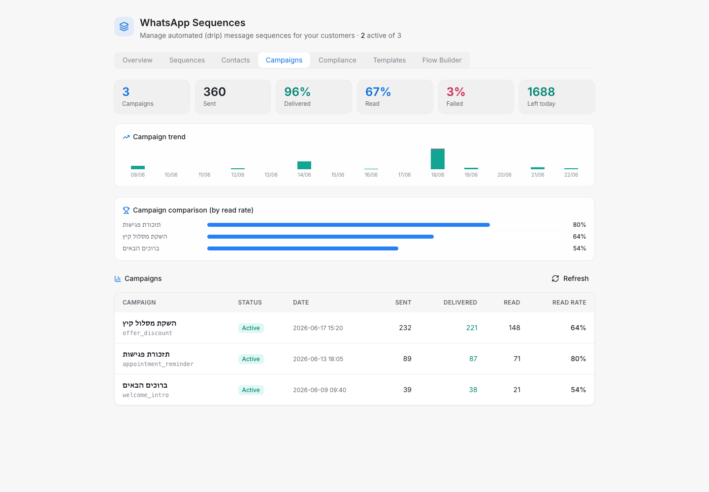</td><td></td></tr>
</table>

### 👥 Contacts
Every lead currently in a sequence, in one table: which sequence, which step, what happens next and when. Search by phone or sequence, filter by state (active / stuck / completed / stopped), enroll a lead by hand, or bulk-enroll everyone carrying a Chatwoot label. Each row opens a panel to restart, advance, or remove that lead from its sequence.

<table>
<tr><td width="50%" align="center"><b>🇬🇧 English</b></td><td width="50%" align="center"><b>🇮🇱 עברית</b></td></tr>
<tr><td>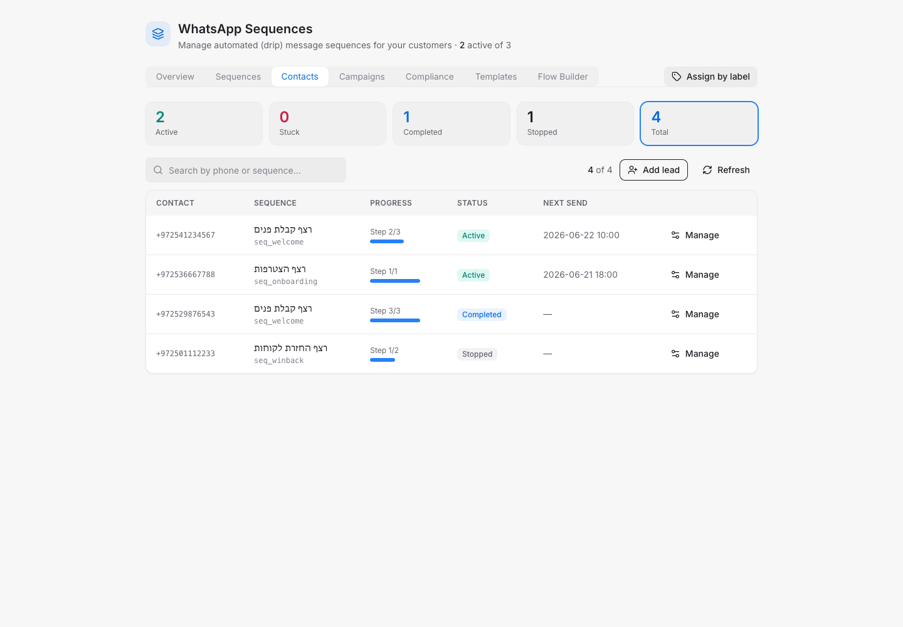</td><td></td></tr>
</table>

---

## Quick Start

Run this **on your self-hosted Chatwoot host**, as root or with sudo:

```bash
curl -fsSL https://github.com/achiya-automation/chatwoot-power-tools/archive/refs/heads/main.tar.gz | tar xz \
  && cd chatwoot-power-tools-main \
  && sudo bash install.sh
```

It detects your Chatwoot installation, asks for a yes/no confirmation, and installs all three modules. Prefer to review the code first (recommended) or use `git`?

```bash
git clone https://github.com/achiya-automation/chatwoot-power-tools.git
cd chatwoot-power-tools
sudo bash install.sh --dry-run   # see the full plan — zero changes made
sudo bash install.sh             # install for real
```

## Modules

| Module | `--modules=` flag | What it adds |
|---|---|---|
| Smart Contact Import | `import` | CSV/Excel import wizard in the dashboard |
| WhatsApp Sequences | `sequences` | The sidecar engine and its full dashboard: sequences, flow builder, template studio, compliance, campaign analytics, contacts — plus the sidebar entry |
| Dashboard Enhancements | `dashboard` | Campaign modal upgrade, reusable template media, native Hebrew fixes and campaign analytics |

The `sequences` module is one install unit, not six — the screens above all live in the
same sidecar app and share its engine and database schema.

Install all three (default), or just the ones you want:

```bash
sudo bash install.sh --modules=all
sudo bash install.sh --modules=import,sequences
sudo bash install.sh --modules=dashboard
```

`--modules` is the complete desired state, not an additive switch. Re-running with a
subset removes stale unselected module directories/static assets, writes the exact
selection to `CWPT_ENABLED_MODULES`, and disables unselected API routes, SPA entry points,
database migrations/grants and background loops. An `import`-only install therefore does
not provision the database role or run owner migrations; when shrinking an existing
database-backed install, it revokes the role's public-table/function access and clears the
database credential passed to the replacement container. `dashboard` reuses the sidecar's
compiled campaign viewer, but non-campaign SPA entries and all sequence actions stay
server-blocked. Existing `drip` data is never dropped when shrinking a selection.
If the Git checkout itself is `/opt/chatwoot/chatwoot-power-tools`, selected deployment
artifacts live in its isolated `.cwpt-runtime/` child; subset installs and uninstall never
delete tracked checkout files.

## Usage

```
Usage: install.sh [options]

  --dry-run          Show the installation plan; make no changes.
  --uninstall        Remove chatwoot-power-tools (route, engine container, dashboard
                      script). The provisioned database role/schema is left in place —
                      a manual DROP is printed, never run automatically.
  --modules=LIST     Comma-separated: all | import,sequences,dashboard (default: all).
  --yes              Do not prompt for confirmation.
  -h, --help         Show this help.
```

Uninstalling is the same command with one flag:

```bash
sudo bash install.sh --uninstall
```

---

## 🔒 Security

Built to be safe to run on a production support desk:

- **Least-privilege database role.** `drip_engine` gets read-only `SELECT` on only the Chatwoot tables the selected modules need (including contact names, phones and emails for sequence/contact/campaign views). With `sequences`, writes are limited to `contacts.custom_attributes` (assignment state) and the two `channel_whatsapp` template-cache columns `message_templates` / `message_templates_last_updated`; dashboard-only re-runs explicitly revoke those writes. It cannot change contact names, phones, emails, or any other contact field.
- **No secrets in this repo.** The role's password is generated on **your** server with `openssl rand` and written only to your Chatwoot `.env`. It never enters logs, command output, or git.
- **No telemetry, no third parties.** The engine talks only to your own Chatwoot API (which relays WhatsApp to Meta exactly as it already does for any WhatsApp channel) and the public [Hebcal](https://www.hebcal.com/) holiday API. Nothing else — no analytics, no phone-home.
- **Non-destructive.** `--uninstall` removes everything it added and **preserves any existing `DASHBOARD_SCRIPTS`** content (it edits only its own marked block) and your data. The DB role/schema is left for you to drop manually.
- **Auditable & previewable.** A plain, readable Bash installer — no opaque binaries piped to root. Every run is `--dry-run`-previewable, and the full test suite (`node --test` across all modules + a `bats` suite for `install.sh`/`lib/`) runs in CI on every push.
- **Safe to point at a live WhatsApp number.** Consent is required before marketing by default, opt-outs are honoured automatically, and sending halts on its own when Meta's quality rating — or actual delivery — drops. See [docs/meta-compliance.md](docs/meta-compliance.md) for the rules and where each is enforced.

---

## Requirements

- A **self-hosted** Chatwoot instance on Docker Compose v2, on a Linux host you can access as root/sudo.
- **Chatwoot 4.17.1 or newer.** This is a hard requirement: campaign analytics reads Chatwoot's native `campaign_recipients` table. The installer checks the running Rails image and exits before making changes on older, pre-release, or unversioned builds. For a verified unversioned image tag, pass its real stable version as `CWPT_CHATWOOT_VERSION=X.Y.Z`.
- Chatwoot's `SafeFetch` layer blocks webhook deliveries to private-network hosts, which silently kills the internal journeys webhook (`http://<engine>:3100/drip-api/journey-hook/…`) — sequences stop advancing with `Invalid webhook URL … has no public ip addresses` warnings in Sidekiq logs. Set `SAFE_FETCH_ALLOW_PRIVATE_NETWORK: "true"` in the `environment:` of Chatwoot's `rails` and `sidekiq` services (compose override) and recreate them.
- A reverse proxy in front of Chatwoot: **Caddy or nginx** get an automatic route; anything else (Traefik, etc.) gets a copy-paste config snippet. The installer exits `INCOMPLETE`/non-zero until the public `/chatwoot-addons/drip-api/health` returns the same build, module list and per-run deployment identity as the loopback engine. It publishes the new dashboard block only after this check, so a missing, SPA-fallback, or stale route is never exposed or reported as success.

## How it works

`install.sh` detects your environment, provisions a least-privilege database role + schema, starts a small sidecar container (`cwpt-engine`) alongside Chatwoot's own containers, adds one reverse-proxy route, and injects a dashboard script. Full technical details — the database role's exact grants, the dashboard-script merge strategy, the self-migrating engine — are in [docs/ARCHITECTURE.md](docs/ARCHITECTURE.md).

## FAQ

**Does this work with Chatwoot Cloud?**
No. See the callout above and [docs/hosting.md](docs/hosting.md).

**Is any of my data sent to a third party?**
No. The engine talks only to your own Chatwoot instance's API — Chatwoot itself then relays WhatsApp sends to Meta, exactly as it already does for any WhatsApp Cloud API channel — and to the public Hebcal API for Jewish holiday dates. No analytics, no telemetry.

**What exactly does the installer touch on my server?**
One database role + schema (`drip_engine` / `drip`, least-privilege — see [docs/ARCHITECTURE.md](docs/ARCHITECTURE.md)), one Docker container (`cwpt-engine`), one reverse-proxy route (`/chatwoot-addons/*`), and one marked block inside Chatwoot's `DASHBOARD_SCRIPTS` setting (any existing content there is preserved, not overwritten).

**Can I remove it cleanly?**
Yes — `sudo bash install.sh --uninstall` reverses all of the above. The database role/schema is deliberately left in place (a manual `DROP` command is printed) since destroying data automatically is not a call the installer should make for you.

**My reverse proxy isn't Caddy or nginx. Now what?**
The installer prints a ready-to-paste config block for your proxy instead of failing.

**Is this free?**
The software is free and MIT-licensed. Running it still costs whatever your server already costs. See [docs/hosting.md](docs/hosting.md) for a transparent look at hosting options, including a paid installation/maintenance service if you'd rather not run the installer yourself.

## Contributing

Issues and pull requests are welcome — see the issue templates for bug reports and feature requests. CI (`.github/workflows/ci.yml`) runs the full test suite (`node --test` across all three modules, plus the `bats` suite for `install.sh`/`lib/`) on every push and pull request.

### Seeing the dashboard without installing anything

Every screen above runs locally against fixtures — no Chatwoot, no database, no WhatsApp account:

```bash
cd modules/sequences/webapp && npm install && npm run dev
```

Then open **`http://localhost:5173/?mock=1&account_id=1`**. Add `&tab=` (`overview`, `sequences`, `contacts`, `campaigns`, `compliance`, `templates`, `journeys`) to land on a specific screen, and `&locale=en` or `&locale=he` to switch language — that's how the screenshots in this README were taken.

The fixtures live in `src/data/devFixtures.js` and are deliberately not an all-green account: one paused template, a YELLOW quality rating and an open alert, so the states that actually matter are visible. The whole file is tree-shaken out of production builds (`import.meta.env.DEV`) and never reaches an installed instance.

## License

[MIT](LICENSE)

---

Built by [Achiya Automation](https://achiya-automation.com). This project's revenue model is fully transparent — see [docs/hosting.md](docs/hosting.md) for the disclosed referral links and the paid installation/maintenance service.
